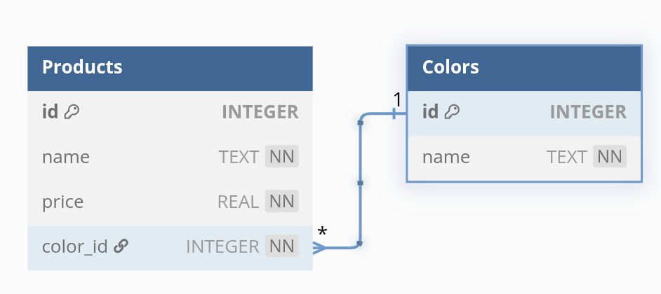

## Знакомство со связанными таблицами

### Задания:
Примечания: при выполнении заданий, пользуйте примерами из **\examples**
1. Создайте связанные таблицы `Products`  и `Colors` \
 \
[Схема тут](https://dbdiagram.io/d/Products-64ba7a1802bd1c4a5e79c16d)
2. Добавьте минимум 3 записи в таблицу Colors
3. Добавьте минимум 6 товаров в таблицу Products
4. Добавьте еще два товара с color_id несуществующих в таблице `Colors`